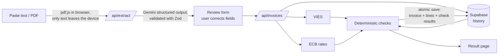

# Invoice Intake Checker

Small businesses and freelancers in the EU receive invoices from suppliers abroad and often process them by hand. That's where mistakes creep in: invalid VAT numbers, invoices paid twice, foreign-currency amounts converted at the wrong rate, and price increases nobody notices.

**Invoice Intake Checker** reads an invoice (pasted text or PDF), lets you review the extracted fields, and then runs a set of checks:

| Check | How | Possible outcomes |
|---|---|---|
| VAT number | Live lookup in the European Commission's **VIES** REST API | valid · invalid · *could not be verified* · not applicable (non‑EU) |
| Currency | **ECB** reference rate on the invoice date via the Frankfurter API | converted to EUR, with the actual rate date shown |
| Duplicate | Same supplier + same invoice number → **problem**; same supplier + same total within 30 days → **warning** | |
| Price increase | Same line item at the same supplier is more expensive than the previous purchase | per item, with % change |
| Totals | Lines add up to the subtotal; subtotal + VAT = total | catches supplier errors *and* extraction errors |

## Design principle: AI only reads, code decides

Only one step uses AI: turning unstructured invoice text into fields (Gemini, with structured output against a JSON schema). Everything after that is plain, deterministic, unit-tested code. The AI can't invent a check result, and every outcome can be traced back to a source: a VIES response, an ECB rate or a previous invoice.

The extraction is treated as a **suggestion**: the user reviews and corrects the fields side by side with the original text before anything is checked or saved. Fields the AI couldn't find are highlighted, and a live consistency hint shows when the amounts don't add up.



## Notable decisions

- **"Could not be verified" is not "invalid".** VIES regularly has outages or timeouts for individual member states. Only an explicit `INVALID` answer from VIES marks a number as invalid; timeouts, `MS_UNAVAILABLE` and the like become a *warning*. Non‑EU suppliers (UK since Brexit, US, CH) are "not applicable" instead of being sent to VIES, which would wrongly answer `isValid: false`. Greece is queried as `EL`.
- **Weekend rates.** The ECB publishes no rates on weekends and holidays. The rate from the previous business day is used, and that date is stored and shown so the conversion is auditable.
- **Check results are stored as snapshots.** The `invoice_checks` table records each check as it was evaluated at intake, so you can later see exactly what the system knew at the time.
- **No fuzzy matching.** Line items are matched on a normalised description (lowercase, no punctuation or accents), suppliers on VAT number or, failing that, on normalised name. That's less "clever" than AI matching, but a reviewer can always see why two things were considered the same.
- **PDF text is extracted client-side.** The PDF never leaves the browser; only the text is sent to the server. Scanned PDFs without a text layer are detected and rejected with a clear message (OCR is out of scope).
- **The browser never talks to the database.** All database access goes through server code using the Supabase secret key. RLS is enabled without policies, so the public key can do nothing. API keys only live in server-side environment variables.
- **Price comparisons across currencies** happen in EUR; within the same currency they use the invoiced price, so exchange-rate movements don't look like price increases.

## Tech stack

- **Next.js 16** (App Router, Route Handlers) + TypeScript + Tailwind CSS v4
- **Supabase** (Postgres) for suppliers, invoices, lines and check results; an RPC function inserts everything in one transaction
- **Gemini API** (`@google/genai`) with `responseJsonSchema`, generated from the same Zod schema used for validation
- **pdf.js** for client-side PDF text extraction
- **Vitest** for the check logic
- Deployed on **Vercel**

## Project structure

```
src/
├─ app/
│  ├─ page.tsx                 New invoice: input → review → save
│  ├─ invoices/                Overview + result page per invoice
│  ├─ suppliers/               Overview + supplier history and price evolution
│  └─ api/
│     ├─ extract/              Text → Gemini → fields (the only AI step)
│     ├─ invoices/             Run checks + save; DELETE per invoice
│     ├─ vat/  fx/             Standalone VIES / exchange-rate lookups
│     └─ demo/reset/           Wipe data and load demo history
├─ lib/
│  ├─ gemini.ts  vies.ts  fx.ts  pdf.ts
│  ├─ schema.ts                Zod schemas shared by client and server
│  ├─ intake.ts                The check pipeline
│  └─ checks/                  Pure, unit-tested check functions
supabase/migrations/           Database schema
public/sample-invoices/        Realistic test invoices (txt + pdf)
scripts/                       Live smoke tests per external API
tests/                         Vitest unit tests
```

## Running locally

```bash
npm install
cp .env.example .env.local   # fill in the keys
npm run dev
```

Environment variables (all server-side only):

| Variable | Where to get it |
|---|---|
| `GEMINI_API_KEY` | [Google AI Studio](https://aistudio.google.com/apikey) (free tier) |
| `GEMINI_MODEL` | optional, defaults to `gemini-flash-lite-latest` (Flash-Lite has a more generous free-tier limit than Flash and is plenty for extraction) |
| `SUPABASE_URL` | Supabase → Project Settings → API |
| `SUPABASE_SECRET_KEY` | Supabase → Project Settings → API Keys → Secret key |

Create the schema by running [`supabase/migrations/001_init.sql`](supabase/migrations/001_init.sql) in the Supabase SQL editor.

Tests and smoke tests:

```bash
npm test                                         # unit tests for all checks
npx tsx scripts/smoke-vies.mts                   # live VIES, incl. simulated outage
npx tsx scripts/smoke-fx.mts                     # live ECB rates, incl. weekend + unknown currency
npx tsx --conditions=react-server scripts/smoke-gemini.mts public/sample-invoices/*.txt
```

## Demo script

1. Go to **Invoices → Reset demo data**. This loads three invoices (German office supplies, UK design studio, US software subscription).
2. **New invoice → Try a sample**, and check these one by one:

| Sample | What you'll see |
|---|---|
| 2. Same supplier, two months later | ⚠️ Price increase: toner €89.50 → €97.90 (+9.4%) |
| 3. Payment reminder | ❌ Duplicate: invoice number `RE 2026 0587` already recorded as `RE-2026-0587` |
| 6. Polish print shop | ❌ VAT number invalid according to VIES, PLN → EUR |
| 7. Swiss translator | ⚠️ Lines add up to CHF 916.00 but the subtotal says CHF 961.00 |
| 8. US subscription billed twice | ⚠️ Same amount ($85.00) 14 days after the previous invoice |

3. Open **Suppliers → Bürowelt Schmidt** to see the price history per item.

The sample invoices are fictional. The VAT numbers used for "valid" results are real, public numbers of unrelated organisations, used only to get a live response from VIES (Germany doesn't publish company names via VIES, so no unrelated name shows up).

## Limitations

- No user accounts: this is a single shared demo workspace. Extraction is rate-limited per IP to protect the free AI quota (in memory, per server instance).
- Scanned PDFs (no text layer) are not supported.
- Duplicate detection only looks within the same supplier; a supplier that changes its VAT number or name significantly is treated as a new supplier.
